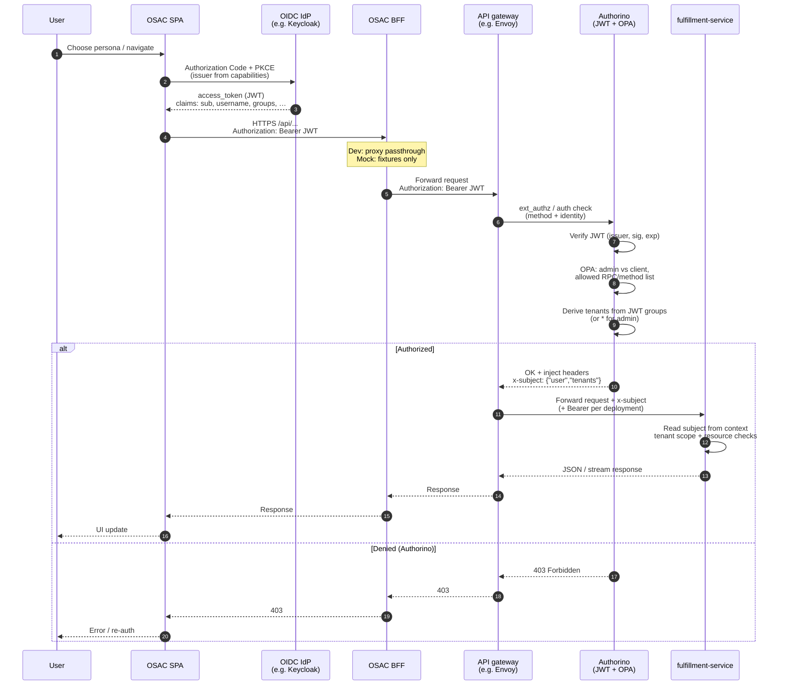
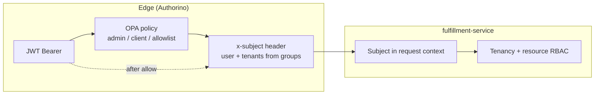

# OSAC — VM-as-a-Service Frontend

OSAC is a fullstack demo application for an OpenShift-based VM-as-a-Service platform. It provides a multi-tenant UI built with React + PatternFly 6, backed by a Go chi reverse proxy that forwards requests to the upstream fulfillment API.

---

## Table of contents

- [Repository layout](#repository-layout)
- [Prerequisites](#prerequisites)
- [Quick start (mock mode)](#quick-start-mock-mode)
- [Running modes explained](#running-modes-explained)
- [Authorization (dev mode and fulfillment RBAC)](#authorization-dev-mode-and-fulfillment-rbac)
- [Demo personas and entry points](#demo-personas-and-entry-points)
- [What is implemented](#what-is-implemented)
- [What needs real integration or further testing](#what-needs-real-integration-or-further-testing)
- [Build and container](#build-and-container)
- [OpenShift deployment](#openshift-deployment)
- [Workspace scripts reference](#workspace-scripts-reference)
- [Project structure](#project-structure)

---

## Repository layout

```
osac/
├── apps/
│   ├── app-frontend/       # React SPA (PatternFly 6, React Router, TanStack Query)
│   └── e2e/                # Cypress end-to-end tests
├── libs/
│   ├── api-contracts/      # Shared TypeScript types + mock data
│   ├── config/             # Shared ESLint, Prettier, tsconfig base
│   └── ui-components/      # Shared PatternFly components (LightDarkToggle, VmStatusLabel, …)
├── proxy/                  # Go chi reverse proxy — forwards /api/* to FULFILLMENT_API_URL
├── deploy/
│   ├── dev/                # OpenShift manifests — development namespace
│   └── integration/        # OpenShift manifests — integration namespace
├── Containerfile           # Multi-stage build (SPA + Go proxy → single image)
└── package.json            # Root pnpm workspace scripts
```

---

## Prerequisites


| Tool    | Minimum version |
| ------- | --------------- |
| Node.js | 20              |
| pnpm    | 9               |
| Go      | 1.23            |


Install pnpm if you don't have it:

```bash
npm install -g pnpm
```

Install all workspace dependencies from the repo root:

```bash
pnpm install
```

---

## Quick start (development)

You need a running fulfillment API. Point `FULFILLMENT_API_URL` at it, then open **two terminals** from the repo root:

**Terminal 1 — Go proxy:**

```bash
FULFILLMENT_API_URL=https://fulfillment.your-env.example.com pnpm dev:proxy
# Server starts on http://localhost:8080
```

**Terminal 2 — SPA:**

```bash
pnpm dev:frontend
# Vite dev server starts on http://localhost:5173
# All /api/* requests are proxied to :8080 automatically
```

Open [http://localhost:5173](http://localhost:5173).

> **No upstream yet?** See `docs/mock-data.md` for documentation on the former Fastify mock layer and what fixtures the SPA still imports client-side.

---

## Proxy

The Go chi proxy (`proxy/`) is a pure reverse proxy. It has no mock mode — it always forwards to `FULFILLMENT_API_URL`.

Proxied path prefixes:

| Prefix                      | Destination                          |
| --------------------------- | ------------------------------------ |
| `/api/fulfillment/v1/*`     | `$FULFILLMENT_API_URL` + original path |
| `/api/events/v1/*`          | `$FULFILLMENT_API_URL` + original path |
| `/api/osac/public/v1/*`     | `$FULFILLMENT_API_URL` + original path |

`/health` and `/ready` are handled locally and return JSON `{ "status": "ok" }` / `{ "status": "ready" }`.

### Environment variables reference


| Variable                           | Default   | Description                                                                                            |
| ---------------------------------- | --------- | ------------------------------------------------------------------------------------------------------ |
| `FULFILLMENT_API_URL`              | *(required)* | Base URL of the upstream fulfillment API (e.g. `https://fulfillment.example.com`).                 |
| `PORT`                             | `8080`    | Proxy listen port.                                                                                     |
| `HOST`                             | `0.0.0.0` | Proxy listen host.                                                                                     |
| `LOG_LEVEL`                        | `info`    | Log level: `debug`, `info`, `warn`, `error`.                                                           |
| `FULFILLMENT_TLS_CA_FILE`          | *(unset)* | PEM bundle for proxy → fulfillment TLS (private PKI).                                                  |
| `FULFILLMENT_TLS_INSECURE`    | *(unset)* | Set to `1` to skip TLS verification for upstream (dev only).       |
| `TEMP_FULFILLMENT_STATIC_BEARER`   | *(unset)* | TEMP: inject `Authorization: Bearer …` when the client sends no non-empty Bearer. |
| `OIDC_CLIENT_ID` | `osac-ui` | client_id registered in the IdP for this UI application. |
| `OIDC_TLS_INSECURE` | *(unset)* | Set to `1` to skip TLS verification for auth provider (dev only). |


**SPA (Vite dev):** optional `VITE_DEV_BEARER_TOKEN` — see `apps/app-frontend/.env.example`. Public API contract: [buf.build/osac-project/public-api](https://buf.build/osac-project/public-api) (this repo uses REST via the proxy until Connect/gRPC-Web is confirmed on the live gateway).

---

## Authorization (dev mode and fulfillment RBAC)

In **mock mode** (`OSAC_API_MODE=mock`), the BFF serves fixtures. The SPA does not need a real identity provider or `Authorization` header for those routes.

In **dev mode** (`OSAC_API_MODE=dev` with `FULFILLMENT_API_URL`), the SPA should call the BFF with `Authorization: Bearer <access_token>` on requests that proxy to fulfillment. The BFF forwards the request (including that header) to the upstream fulfillment REST gateway. Between the browser and fulfillment-service, the cluster typically runs an **API gateway + Authorino**: Authorino validates the JWT, runs policy (for example OPA: admin vs client and allowed operations), maps **JWT `groups`** (or equivalent claims) to **tenant scope**, and injects `**x-subject`** (`user` + `tenants`) for fulfillment-service. The service then enforces tenancy and resource-level access. The browser never receives `x-subject`; it is an edge-to-service contract.

**Current SPA behavior (dev path):** the sign-in page loads `GET /api/fulfillment/v1/capabilities`. If `authn.trustedTokenIssuers` is non-empty, the UI treats dev sign-in as **paste a JWT access token** (stored for subsequent API calls). Full **OIDC Authorization Code + PKCE** against that issuer is the spec target; see `docs/specs/backend-fulfillment.yaml` → `context.osac_real_api_integration`.

### End-to-end sequence (SPA → Authorino → fulfillment-service)




### Where `x-subject` fits (edge vs application)




---

## Demo personas and entry points

The welcome page (`/`) is a **booth operator entry screen**, not a customer-facing login. It uses **three role columns** (Provider Admin, Tenant Admin, Tenant User). Under **Tenant Admin** and **Tenant User**, pick **Northstar Bank** or **Bluestone Financial** to set `tenantId` + role, then continue to sign-in. **Provider Admin** uses **Enter** (Vertexa / cross-tenant context).


| Entry surface                 | Role            | What they see after login                                                        |
| ----------------------------- | --------------- | -------------------------------------------------------------------------------- |
| **Provider Admin → Enter**    | `providerAdmin` | Cross-tenant dashboard, organizations, global templates, infrastructure topology |
| **Tenant User → org button**  | `tenantUser`    | VM dashboard, My VMs, template catalog, recent activities                        |
| **Tenant Admin → org button** | `tenantAdmin`   | Admin dashboard, users, quota, networks, template catalog                        |


All paths navigate to `**/sign-in`** in the **same tab**. Sign-in is a **single institutional screen** (`InstitutionalSignInPage`): copy, trusted-issuer alert, and accents follow the **selected tenant** via `components/login/institutionalBranding.ts` — there are no separate routed pages per bank.

You can also deep-link directly to a persona by appending a query parameter (cold load):

```
http://localhost:5173/?osac-entry=northstar-user
http://localhost:5173/?osac-entry=northstar-admin
http://localhost:5173/?osac-entry=evergreen-user
http://localhost:5173/?osac-entry=evergreen-admin
```

(`evergreen-*` is the **tenant id** for Bluestone Financial in code and config; the welcome UI labels it “Bluestone”.)

---

## What is implemented

```mermaid
flowchart TB
  subgraph Users["Clients"]
    UI[osac-ui / consoles]
    CLI[fulfillment-cli archived]
  end

  subgraph Core["Core runtime"]
    FS[fulfillment-service API + DB]
    OP[osac-operator CRDs + reconcile]
  end

  subgraph Deploy["Integration & install"]
    INS[osac-installer]
  end

  subgraph Auto["Automation"]
    AAP[osac-aap]
  end

  subgraph Platform["Hub / cloud stack"]
    ACM[ACM / MCE / HCP]
    VIRT[OCP-Virt / KubeVirt]
    OVN[OVN UDN / Tenant networking]
    KC[Keycloak / OIDC]
    AUTH[Authorino / gateway policy]
  end

  subgraph More["Other org repos public listing"]
    DOC[docs]
    EP[enhancement-proposals]
    TI[osac-test-infra]
    GC[github-config]
    WS[osac-workspace]
    HM[host-management-openstack]
    ISS[issues]
  end

  UI --> FS
  CLI -.->|archived| FS
  FS --> OP
  FS --> KC
  INS --> FS
  INS --> OP
  INS --> AAP
  OP --> AAP
  OP --> ACM
  OP --> VIRT
  OP --> OVN
  OP --> AUTH
  DOC -.-> DOC
  TI -.->|e2e| INS


### Frontend (React SPA)


| Area                               | Status | Notes                                                                                                               |
| ---------------------------------- | ------ | ------------------------------------------------------------------------------------------------------------------- |
| Welcome / role selection page      | ✅      | Three role columns; org buttons for tenant admin/user; Provider Enter                                               |
| Institutional sign-in (`/sign-in`) | ✅      | One `InstitutionalSignInPage`; tenant-aware branding + `LoginForm`                                                  |
| Application shell                  | ✅      | Masthead, role-based sidebar nav, breadcrumbs, light/dark toggle                                                    |
| Tenant user dashboard              | ✅      | VM power-state stat cards, create VM                                                                                |
| My VMs — card view                 | ✅      | Power filter, search, card grid                                                                                     |
| My VMs — table view                | ✅      | Compact sortable table                                                                                              |
| VM detail drawer                   | ✅      | Overview, Networking, Conditions tabs; power actions                                                                |
| Create VM wizard                   | ✅      | Modal wizard; steps under `components/vm/createVmWizard/`. POSTs to BFF.                                            |
| Template catalog                   | ✅      | Searchable gallery, detail drawer, launches wizard                                                                  |
| Recent activities feed             | ✅      | Mock: derived from VM list. **Dev (spec):** `GET /api/events/v1/events` — see `docs/specs/backend-fulfillment.yaml` |
| Tenant admin dashboard             | ✅      | Summary stats, navigation tiles                                                                                     |
| Tenant admin — Users               | ✅      | Table of demo users                                                                                                 |
| Tenant admin — Quota control       | ✅      | Resource consumption visualization                                                                                  |
| Tenant admin — Networks            | ✅      | Network topology graph                                                                                              |
| Provider admin dashboard           | ✅      | Cross-tenant summary, navigation tiles                                                                              |
| Provider — Tenant organizations    | ✅      | Organization list                                                                                                   |
| Provider — Infrastructure topology | ✅      | Platform-wide VM topology                                                                                           |
| Provider — Global templates        | ✅      | Reuses template catalog (provisioning blocked for provider context)                                                 |
| Multi-tenant data isolation        | ✅      | Each tenant tab sees its own VM set                                                                                 |
| Light / dark theme                 | ✅      | Per-tenant default, togglable in masthead                                                                           |
| RBAC — nav and route guards        | ✅      | Nav items and routes are role-gated                                                                                 |


### Backend (Go chi proxy)


| Area                           | Status | Notes                                                                                                                                 |
| ------------------------------ | ------ | ------------------------------------------------------------------------------------------------------------------------------------- |
| Upstream proxy                 | ✅      | `/api/fulfillment/v1/*`, `/api/events/v1/*`, `/api/osac/public/v1/*` — buffered passthrough; **spec:** `docs/specs/backend-fulfillment.yaml` `bff_proxy_matrix_dev` |
| Health / readiness probes      | ✅      | `/health` and `/ready`                                                                                                                |                                              |
| TLS upstream                   | ✅      | Custom CA via `FULFILLMENT_TLS_CA_FILE`; dev-only insecure skip via `FULFILLMENT_TLS_INSECURE`                                   |
| Authorization passthrough      | ✅      | Inbound `Authorization` header forwarded; static bearer workarounds via `TEMP_FULFILLMENT_STATIC_BEARER`                              |
| Mock mode                      | ❌      | Removed — see `docs/mock-data.md` for how mock data was structured and what the SPA still imports client-side                        |


### Shared libraries


| Library                                                          | Status |
| ---------------------------------------------------------------- | ------ |
| `@osac/api-contracts` — TypeScript types                         | ✅      |
| `@osac/api-contracts` — Mock data (VMs, templates, orgs, events) | ✅      |
| `@osac/ui-components` — `LightDarkToggle`                        | ✅      |
| `@osac/ui-components` — `VmStatusLabel`                          | ✅      |
| `@osac/ui-components` — `PlaceholderPage`                        | ✅      |
| `@osac/ui-components` — `NetworkTopologyPage`                    | ✅      |


---

## What needs real integration or further testing

Authoritative checklist for the **dev/real** integration target: `docs/specs/backend-fulfillment.yaml` → `**context.osac_real_api_integration`** (mock mode invariant is spelled out there). The following areas work in mock mode but require additional work before the SPA fully satisfies that contract:

### Authentication (highest priority)

- **Mock mode:** the institutional sign-in screen still simulates a short loading delay then sets `isLoggedIn = true` client-side (no real IdP).
- **Dev mode (partial):** when `GET /api/fulfillment/v1/capabilities` returns `authn.trustedTokenIssuers`, the sign-in flow can store a **pasted JWT access token** for `Authorization: Bearer` on BFF calls. This exercises upstream + Authorino when the cluster is wired correctly; it is not a full browser OIDC flow.
- **Integration needed:** Implement **Authorization Code + PKCE** against the issuer from capabilities; refresh / logout UX; attach the acquired token to all proxied BFF requests. See [Authorization](#authorization-dev-mode-and-fulfillment-rbac).
- The BFF passes `Authorization` through to the upstream in dev mode for proxied prefixes.

### Per-tenant data scoping

- In mock mode, all tenants share the same `vmStore` in the BFF process. A real environment must scope requests by tenant (namespace, org ID, or equivalent). The frontend passes no tenant identifier in API calls today.
- **Integration needed:** Add a tenant header or use tenant-namespaced API paths. The BFF proxy must enforce tenant isolation or delegate it to the upstream.

### VM power actions (PATCH)

- **My VMs:** Start / Stop / Restart call `PATCH` via `usePatchVm`. Pending badges via `useVmPowerActionDisplay` + `vmPowerPendingStore` (survives navigation). Power PATCH does not immediately refetch the list; pending actions poll every **10s**. Restart: **Restarting** → **Starting** → **running** per list GET (ignores stale terminal states).

### VM actions not in menu (clone / migrate)

- **Clone** and **Migrate** are not shown in `VmActionsMenu` until fulfillment supports them (UI commented with `RESTORE` markers). Create-from-template remains the supported wizard path.

### VM deletion

- **My VMs:** Delete in `VmActionsMenu` — confirm modal shows **Deleting** on confirm (`usePendingVmDeletes`). If not stopped, **PATCH stop** then `DELETE`. Card removed when list GET omits the VM (not on first server `deleting` state).

### VM creation — request body shape

- `createComputeInstance()` POSTs **ComputeInstance** JSON at the **root** (the gateway rejects a top-level `"object"` key). The body is built with `serializeComputeInstanceForCreate()` (proto JSON / snake_case). The mock BFF may still accept `{ "object": … }` for local tests.

### Quota page

- `AdminQuotaPage` displays static quota numbers from `libs/api-contracts/src/mock-data.ts`. There is no API call.
- **Integration needed:** Add a `/api/private/v1/quota` endpoint in the BFF and a `useQuota()` hook in the frontend.

### Users page

- `AdminUsersPage` shows a hardcoded list of demo users from mock data. There is no user management API.
- **Integration needed:** Add user list / invite / remove endpoints (private API) and wire the page to them.

### Real-time events / SSE

- **Spec (dev mode):** Dashboard and full-page recent activities **SHOULD** use fulfillment’s `GET /api/events/v1/events` (Events watch) with the BFF proxying that path when `OSAC_API_MODE=dev`, same Authorization passthrough as `/api/fulfillment/v1/`*. See `docs/specs/backend-fulfillment.yaml` (`context.osac_bff_runtime_modes`, flow `tenant-user-dashboard-activities`).
- **Current code:** The BFF proxies `/api/events/v1/`* in dev mode; in mock mode it still returns a static JSON array. The frontend does not yet open an `EventSource` / stream consumer against the live watch.
- **Integration needed:** Implement SSE or chunked stream handling and consume it in the dashboard + recent-activities pages per the spec.

### Network topology — real data

- `NetworkTopologyPage` groups VMs by their `spec.subnet` field. In mock data these are populated. A real environment must return `spec.subnet` (or equivalent) from the upstream.
- Test with real VMs to verify grouping logic.

### E2E tests — coverage

- Three Cypress specs exist: `welcome-and-role-selection`, `institutional-sign-in`, `application-shell-session`. They cover the happy path only.
- **Needed:** Specs for VM CRUD, wizard steps, admin flows, provider flows, and error states.

### Storybook

- `libs/ui-components` is configured for Storybook but no story files (`.stories.tsx`) exist.
- **Needed:** Stories for `LightDarkToggle`, `VmStatusLabel`, `PlaceholderPage`, `NetworkTopologyPage`.

### Placeholder pages

- Several sidebar nav items navigate to routes that render `<PlaceholderPage />`:
  - `/admin/storage` — Storage
  - `/admin/org-settings` — Organization settings
  - `/admin/security` — Security & Compliance (tenant)
  - `/provider/allocation` — Resource allocation
  - `/provider/security` — Security & Compliance (provider)
  - `/provider/settings` — Platform settings

---

## Build and container

### Production build (SPA + BFF compiled)

```bash
pnpm build
```


This runs `tsc` on the backend and `vite build` on the frontend. The SPA output lands in `apps/app-backend/public/` so the BFF can serve it.

### Container image

```bash
# Build
podman build -t osac:latest -f Containerfile .

# Run in mock mode
podman run --rm -p 8080:8080 -e OSAC_API_MODE=mock osac:latest

# Run in dev/proxy mode
podman run --rm -p 8080:8080 \
  -e OSAC_API_MODE=dev \
  -e FULFILLMENT_API_URL=https://fulfillment.your-env.example.com \
  osac:latest
```

The container exposes port `8080`. The BFF serves the SPA at `/` and the API at `/api/*`.

---

## OpenShift deployment

Manifests live in `deploy/dev/` and `deploy/integration/`.

```bash
# Create namespace
oc new-project osac-dev

# Apply all manifests
oc apply -f deploy/dev/

# Watch rollout
oc rollout status deployment/osac -n osac-dev
```

The `configmap.yaml` in each environment folder controls `OSAC_API_MODE`, `FULFILLMENT_API_URL`, and `LOG_LEVEL`. Edit it before applying to switch between mock and real API modes.

To expose the service externally:

```bash
oc expose svc/osac -n osac-dev
oc get route osac -n osac-dev
```

---

## Workspace scripts reference

Run all scripts from the **repo root**:


| Script                     | Description                                                                      |
| -------------------------- | -------------------------------------------------------------------------------- |
| `pnpm dev:proxy`           | Start Go chi proxy (`proxy/`) on `:8080`; requires `FULFILLMENT_API_URL`         |
| `pnpm dev:frontend`        | Start Vite dev server with HMR on `:5173`; proxies `/api/*` to `:8080`           |
| `pnpm build`               | Build SPA (`apps/app-frontend/dist`) and compile Go proxy binary                 |
| `pnpm lint`                | ESLint across all packages                                                       |
| `pnpm check:pf-primitives` | Guardrail: disallowed raw HTML for layout in `app-frontend`                      |
| `pnpm test`                | Vitest unit tests across all packages                                            |
| `pnpm storybook`           | Start Storybook for `@osac/ui-components`                                        |
| `pnpm build-storybook`     | Build static Storybook                                                           |
| `pnpm e2e:ci`              | Run Cypress E2E tests headlessly                                                 |


---

## Project structure

```
libs/api-contracts/src/
  types.ts          # All shared TypeScript interfaces (ComputeInstance, ClusterTemplate, …)
  mock-data.ts      # Fixture data — VMs, templates, orgs, users, quota, events
  index.ts          # Re-exports everything

apps/app-frontend/src/
  App.tsx           # Routes: /, /sign-in, /* → AppShell when logged in
  api/
    client.ts       # Typed fetch functions → /api/fulfillment/v1/*
    hooks.ts        # TanStack Query hooks (useComputeInstances, useComputeInstanceTemplates, …)
  contexts/
    SessionContext.tsx  # Auth state, tenant/role, theme, topology handoff, persona selection
  pages/
    auth/
      WelcomePage.tsx     # Role columns + org entry (welcome-and-role-selection)
      SignInPage.tsx      # Wraps InstitutionalSignInPage (institutional-sign-in)
      index.ts            # Barrel re-exports
    shell/
      AppShell.tsx        # Authenticated chrome + nested routes
      ShellMasthead.tsx   # Masthead, sovereignty strip, toolbar, user menu
      ShellSidebar.tsx    # Role-based nav (see shellNav.ts)
      ShellBreadcrumb.tsx
      shellNav.ts         # Nav model per role
      shellRoutes.ts      # Placeholder routes for admin/provider
      index.ts
    tenant/               # Tenant user surfaces (VMaaS)
      DashboardPage.tsx, VmListPage.tsx, CatalogPage.tsx, RecentActivitiesPage.tsx
      index.ts
    admin/                # Tenant admin
      AdminDashboardPage.tsx, AdminUsersPage.tsx, AdminQuotaPage.tsx, AdminNetworksPage.tsx
      index.ts
    provider/             # Provider admin
      ProviderAdminDashboardPage.tsx, ProviderTenantOrgsPage.tsx, ProviderInfraTopologyPage.tsx
      index.ts
  components/
    layout/
      PageHeader.tsx      # Shared page title + optional description + actions
      index.ts
    dashboard/            # Tenant dashboard tiles / metrics (where used)
    login/
      InstitutionalSignInPage.tsx  # Single sign-in shell; uses institutionalBranding.ts
      LoginForm.tsx                # Shared email/password form
      institutionalBranding.ts     # Per-tenant strings and trusted-issuer copy
    vm/
      CreateVmWizard.tsx           # Modal orchestrator + ref handle (open / template / clone)
      createVmWizard/              # Wizard steps, types, constants, stepIds
      VmDetailDrawer.tsx, VmTable.tsx, VmActionsMenu.tsx, TemplateCard.tsx, …

proxy/
  main.go           # Go chi reverse proxy — config, TLS, proxy handler, static serving
  go.mod / go.sum   # Go module (github.com/go-chi/chi/v5)
  Makefile          # build / run / lint / clean
```

**Routing recap:** `App.tsx` imports shell and auth pages from `pages/shell` and `pages/auth`. Logged-in routes live under `AppShell` (`pages/shell/AppShell.tsx`) and map to `tenant/`*, `admin/`*, and `provider/*` paths per role (see `docs/specs/ui-flows/application-shell-session.yaml` for the canonical matrix).